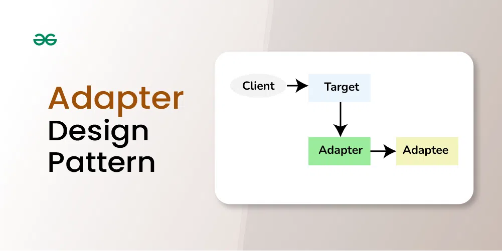

# Example of Adapter Design Pattern

Suppose you have a weighing machine that returns weight in pounds. Now, the client only understands weight in KG. So we will bring in one Adapter (or a bridge) that will convert weight got in Pounds to KG.

