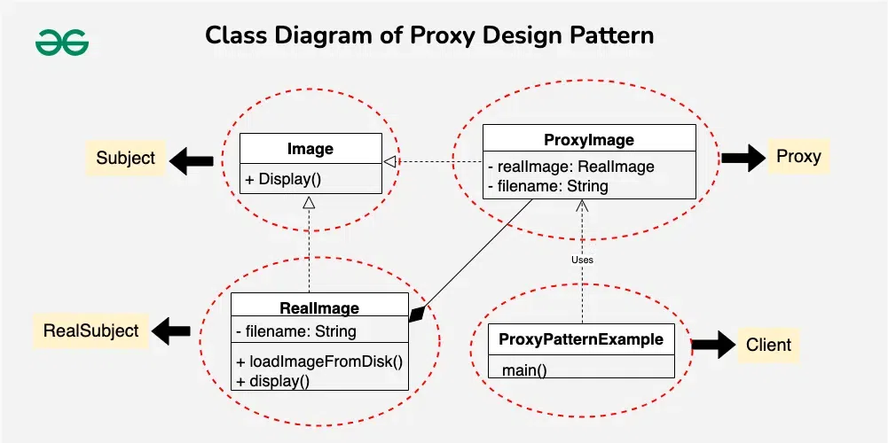

# Example of Proxy Design Pattern

The Proxy Design Pattern is a design pattern in which the client and the actual object are connected by a proxy object. The client communicates with the proxy, which manages access to the real object, rather than the real object directly. Before sending the request to the real object, the proxy can take care of additional tasks like caching, security, logging, and lazy loading.

Example: Loading of an image.

